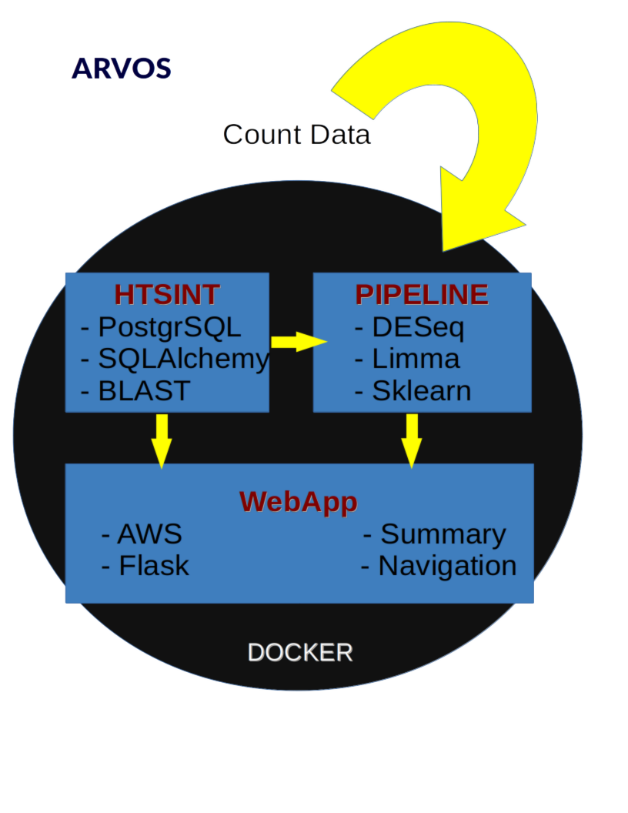

Introduction
----------------
Version: 0.1.1  
Authors: William Montgomery, Gareth Halladay, Amber Scott, Anela Tosevska, Frank Burkholder, Adam Richards, Andrew Gaines  
Web site: https://biof-git.colorado.edu/hackathon/summarizing_rnaseq  
Documentation: ?????  
Copyright: This document has been placed in the public domain.  
License:  is released under the MIT License

Purpose
----------------

RNA-Seq technologies have revolutionized the biological sciences.  One
challenging aspect of these data is that there is so much information
contained within a given experiment that results sections do little
more than scratch the surface. Results change with time, because model
get changed or updated and things like annotations are continually
changing.

The first objective here is to create an interactive results summary
environment.  All version of the results can be displayed and
iterative updates should be made easy.  The backbone of this objective
will be with Flask and AWS.
This ties into the second objective where we want to create an
environment that **encourages** the comparison of models.  Sklearn has
become one of the easiest toolkits to carry out predictive analytics
and it will be at the center of our solution for this objective.

Methods
----------------

Examples
-----------------

Lets turn these two analyses into something shiny and new.

  * https://ajrichards.github.io/public/pieris-supplement/index.html
  * https://ajrichards.github.io/public/aad/index.html
``htsint`` (High-Throughput Sequencing INTegrate) is a Python package used to create gene sets for the study of high-throughput sequencing data. The goal is to create functional modules through the integration of heterogeneous types of data. These functional modules are primarily based on the Gene Ontology, but as the package matures additional sources of data will be incorporated. The functional modules produced can be subsequently tested for significance in terms of differential expression in RNA-Seq or microarray studies using gene set enrichment analysis.
  * BLAST mapping
  * Gene Ontology queries
  * Heatmaps for differential expression analysis
  * Creation of gene sets for gene set enrichment analysis
  * Visualization of gene sets
  
Software stack
----------------
For more details visit the documentation:

  * [PostgreSQL](www.postgresql.org)
  * [SQLAlchemy](http://www.sqlalchemy.org)
  * [htsint](http://ajrichards.github.io/htsint)
  * [DESeq2](http://bioconductor.org/packages/release/bioc/html/DESeq2.html)
  * [sklearn]([http://scikit-learn.org/stable)
  * [Flask](http://flask.pocoo.org)
  
Useful References
------------------

  * https://www.ncbi.nlm.nih.gov/pubmed/26399714
  * http://www.biorxiv.org/content/early/2016/12/02/091280.article-info
